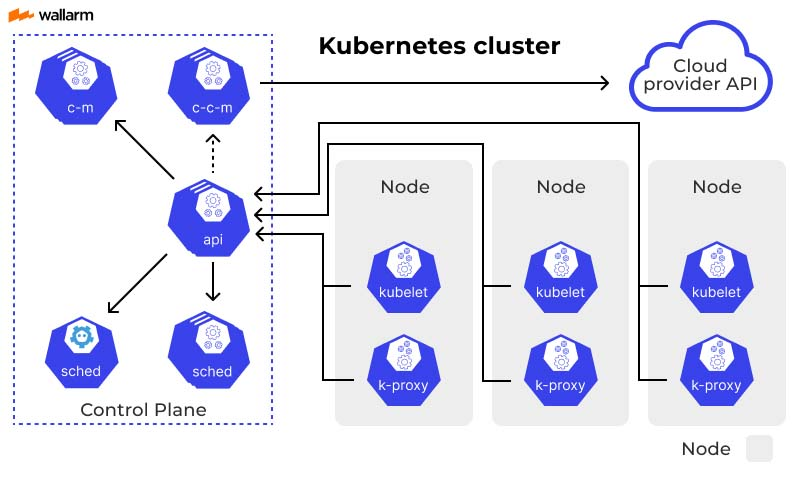
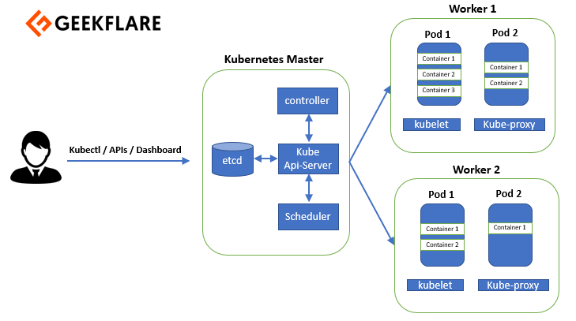

# Kubernetes

## 개요

쿠버네티스에 대해 학습합니다.

 

## 목차

[1.쿠버네티스 기초](#1-쿠버네티스-기초)

[2.쿠버네티스 기본 개념](#쿠버네티스-기본-개념)

 
 

## 1. 쿠버네티스 기초

 

### (1) IT 환경의 진화

1990년대의 IT 시스템은 대부분 다른 프로그램에 서비스를 요청하는 클라이언트와 그 요청에 응답하는 서버로 구성된 클라이언트/서버 형태였고, 그 후에는 서버의 안정성을 위해 중앙집중식으로 시스템을 운영하는 메인프레임이 도입되었다.

하지만 중앙집중식로 구축된 서버는 빠른 비즈니스의 변화에 대응할 수 없었기에, 2000년대에 가상화 환경이 등장하였다.

x86 호스트 운영체제(linux or window) 위에 가상화 계층을 두고 가 위에 여러개의 x86 게스트 운영 체제를 올려서 사용하는 가상화 환경으로 전환해 비즈니스 변화에 대응했다. x86 가상화 환경은 인프라를 확장할 때 스케일 아웃 방식을 사용하고 메인 프레임은 스케일 업 방식을 사용했다.

 

스케일 아웃은 기존 서버와 같은 사양 혹은 비슷한 사양의 '서버 대수'를 늘려서 처리 능력을 향상시키는 것이고, 스케일업은 CPU나 RAM을 추가해 '서버 성능' 자체를 향상 시키는 것이다. 스케일 아웃 방식을 사용하는 x86 가상화 환경은 애플리케이션을 추가할 때 가상화 계층 위에 새롭게 게스트 서버를 추가하거나 물리 서버를 추가하기에 기존 서버에 영향을 주지 않으면서 간단하게 확장했다.

2010년 대에는 내부적으로 물리 서버에 인프라를 설치하는 것은 초기 비용이 많이 들었기에, 자체적으로 시스템을 도입을 하는 것보다 이미 구축된 외부 서버를 대여하여 사용하는 클라우드를 사용하게 되었다.

 

 

퍼블릭 클라우드는 제공 서비스에 따라서 IaaS, PaaS, SaaS로 나누어진다. IaaS는 Infrastructure as a Service의 약자로, 인프라만 클라우드 벤더의 장비를 빌려서 사용하는 모델이고, PaaS는 Platform as a Service는 개발 환경까지 클라우드 벤더가 책임지고 유지 관리를 하며 SaaS는 서비스 영역까지 클라우드 벤더가 책임지고 관리하는 모델이다.

그 후에는 컨테이너 환경이 등장하였다.

### (2) 컨테이너

컨테이너는 데스크톱, 리눅스 등 어디서나 애플리케이션 및 서비스를 실행하는 데 필요한 모든 요소를 포함하는 소프트웨어 패키지다. 이 패캐지리를 이용하면 운영 체제를 논리적인 구획으로 나누고 애플리케이션을 격리된 환경에서 실행할 수 있다.

일반적인 가상화의 경우에는 하이퍼바이저 위에 가상 머신을 올려서 사용하지만, 컨테이너 환경에서는 하이퍼바이저 대신에 도커 같은 컨테이너 런타임 위에 컨테이너를 올려서 사용한다.

일반적인 가상 환경은 핟웨어 수준에서 가상화되지만, 컨테이너는 운영 체제 수준에서 가상화된다. 컨테이너는 운영 체제의 커널을 공유하기 때문에 상대적으로 가볍고 유연하게 운영할 수 있다. 가상머신과 비교했을 때 자원을 더 적게 사용해서 하나의 시스템에서 더 많은 애플리케이션을 구동할 수도 있고 운영체제를 공유해서 사용하여 유지 관리와 관련된 오버헤드가 줄어든다는 장점이 있다.

이렇게 컨테이너를 생성하고 실행할 수 있도록 도와주는 것이 바로 컨테이너 런타임 입니다. 그리고 컨테이너를 효과적으로 관리하도록 도와주는 것이 컨테이너 오케스트레이션이며, 그 대표적인 툴이 쿠버네티스다.

### (3) 쿠버네티스

쿠버네티스는 컨테이너 기반의 애플리케이션을 개발하고 배포할 수 있도록 설계된 오픈 소스 플랫폼이다. 하나의 애플리케이션을 생성하기 위해서는 하나 이상의 파드가 필요하다. 이 파드는 쿠버네티스에서 생성할 수 있는 가장 작은 배포 단위이면서 단일 혹은 다수의 컨테이너를 포함한다.

파드 외에 서비스, 볼륨, 네임스페이스 등을 묶어서 오브젝트라고 부르며, 오브젝트는 쿠버네티스에서 상태 관리가 필요한 대상이다.

- 파드 : 쿠버네티스의 가장 기본적인 배포 단위
- 서비스 : 배포한 파드를 외부에서 접근할 수 있게 한다.
- 네임스페이스 : 쿠버네티스 클러스트의 논리적인 분리 단위
- 볼륨 : 컨테이너의 파일을 저장하고 컨테이너 간 파일을 공유할 수 있는 저장소

파드는 쿠버네티스에서 가장 기본적인 배포 단위이면서 하나 이상의 컨테이너를 포함하며, 쿠버네티스는 하나의 컨테이너를 개별적으로 하나씩 배포하는 것이 아니라 유사한 역할을 하는 컨테이너를 파드라는 단위로 묶어서 배포한다는 것이다.

도커 런타임이 설치된 환경에서 컨테이너를 실행하고 유지 관리하는 것을 워커 노드라고 하며, 리눅스 위에 도커 엔진을 설치하고 그 위에 하나 이상의 컨테이너가 포함된 파드를 실행한다.

쿠버네티스는 기본적으로 마스터 노드 1대와 워커 노드 1대로 구성되며, 마스터 노드는 전체 쿠버네티스 환경을 관리하고, 워커 노드는 컨테이너를 실행하고 관리한다. 워커 노드의 자원(CPU, 메모리 등) 사용률이 높을 때 워커 노드의 개수를 늘릴 수 있다. 워커 노드의 개수와 상관 없이 마스터 노드와 워커 노드로 구성된 쿠버네티스를 하나의 클러스터라고 한다.

## 쿠버네티스 기본 개념

### (1) 쿠버네티스 컴포넌트

컨트롤 플레인(마스터 노드)에는 클러스트를 유지하고 제어하기 위한 다양한 컴포넌트가 있고, 워커 노드에도 애플리케이션을 실행하기 위한 컴포넌트들이 있다.

1. API 서버

   API 서버(kube-apiserver)는 클러스터의 API를 사용할 수 있게 해주는 프로세스로, 클러스터로 요청이 들어왔을 때 그 요청의 유효성에 대해 검증한다.

2. etcd

   API 서버는 파드를 만든다는 것을 etcd에 알리고, 사용자에게 파드가 생성되었음을 알린다. etcd는 클러스터에 필요한 정보, 파드와 같은 리소스들의 상태 정보가 담겨있는 곳을 etcd라고 한다. 이 정보들은 키-값 형태로 저장된다.

3. 스케줄러

   스케줄러는 파드를 위치시킬 적당한 워커 노드를 확인하고, API 서버에 이 사실을 알린다. 이후 API 서버는 etcd에 해당 정보를 제공하는 데, 스케줄러는 워커노드의 리소스 사용량을 참조하여 어떤 노드에 파드를 할당할 지 결정한다.

4. kubelet

   API 서버는 파드가 생성될 워커노드에 있는 kubelet에 파드의 생성 정보를 전달하면, kubelet는 해당 정보를 이용하여 파드를 생성한다. kubelet는 클러스터의 각 노드에서 실행되는 에이전트로, 파드에서 컨테이너의 동작을 관리한다. 파드를 생성했다면 kubelet은 다시 API 서버에 생성된 파드의 정보를 전달하고 API 서버는 다시 etcd를 업데이트하여 etcd는 어떤 워커 노드에 어떤 파드가 생성되었는 지 저장한다.

5. 컨트롤러 매니저

   컨트롤러 매니저는 kube-controller-manager와 cloud-controller-manager 두 가지 유형이 있다. kube-controller-manager는 다양한 컴포넌트의 상태를 지속적으로 모니터링하면서 실행 상태를 유지하는 역할을 한다. 예를 들어 워커 노드와 통신이 불가능하다고 판단되면 해당 노드에 할당된 파드를 제거하고 다른 워커 노드에서 파드를 생성하여 서비스가 계속되도록한다.

   cloud-controller-manager는 EKS, AKS와 같은 퍼블릭 클라우드에서 제공하는 쿠버네티스와 연동되는 서비스들을 관리한다.

6. 프록시

   프록시는 클러스터의 모든 노드에서 실행되는 네트워크의 프록시이며, 프록시는 노드에 대한 네트워크의 규칙을 관리하기 때문에 클러스터 내부와 외부에 대한 통신을 담당한다.

7. 컨테이너 런타임

   컨테이너 실행을 담당한다. 대표적인 예로 도커가 있다.

### (2) 쿠버네티스 컨트롤러

쿠버네티스 컨트롤러는 파드를 관리하는 역할을 한다. 쿠버네티스에서 제공하는 컨트롤러는 데몬셋, 디플로이먼트, 레플리카셋, 스테이트풀셋, 잡, 크론잡, 레플리케이션 컨트롤러가 있다.

용도에 따라서 컨트롤러를 사용하는 데, 예를 들어 데몬셋은 클러스터 전체에 파드를 배포할 때 사용한다.

1. 디플로이먼트 (Deployment)

   디플로이먼트는 쿠버네티스에서 상태가 없는 애플리케이션을 배포할 때 사용하는 가장 기본적인 컨트롤러다. 레플리카셋의 상위 개념이면서 파드를 배포할 때 사용한다.

   파드를 배포할 때 다양한 방법을 지원해서 세밀한 조작이 가능하다.

2. 레플리카셋 (ReplicaSet)

   레플리카셋은 몇 개의 파드를 유지할지 결정하는 컨트롤러로, 3개의 파드를 유지하도록 설정하였다면 1개의 파드가 삭제되어도 3개를 유지하기 위하여 1개의 파드를 생성한다.

3. 잡 (Job)

   잡은 하나 이상의 파드를 지정하고 지정된 수의 파드가 성공적으로 실행되도록하는 데, 만약에 노드의 하드웨어 등으로 파드가 비정상적으로 작동하면, 다른 노드에서 파드를 시작해 서비스를 지속시킨다.

4. 크론잡 (CronJob)

   크론잡은 잡의 일종으로 특정 시간에 특정 파드를 실행시키는 것과 같은 지정한 일정에 따라서 잡을 실행시킬 때 사용한다. 주로 중요한 데이터의 백업을 할 때 사용된다.

5. 데몬셋 (DaemonSet)

   데몬셋은 디플로이먼트처럼 파드를 생성하고 관리한다. 디플로이먼트가 실행해야할 파드의 개수와 개수와 배포 전략을 세분화한다면, 데몬셋은 특정 노드 또는 모든 노드에 파드를 배포하고 관리한다. 주로 성능 수집이나 로그 수집 같은 작업에 사용된다.

### (3) 쿠버네티스 서비스

파드는 쿠버네티스 클러스터 안에서 옮겨 다니는 특성이 있는 데, 파드가 실행 중인 워커노드에 문제가 생기면 다른 워커 노드에서 파드가 다시 생성될 수 있고, 이 때 마다 IP가 변경되는 특성이 존재한다.

이에 동적으로 변화하는 파드에 고정된 방법으로 접근하기 위해서 사용되는 것이 서비스다. 서비스를 사용하면 파드가 클러스터 내에 어디에 있든지 고정된 주소를 이용하여 접근할 수 있고 외부에서도 접근이 가능해진다.

쿠버네티스 서비스에는 클러스터 IP, 노드포트, 로드밸런서가 있다.

1. 클러스터 IP (ClusterIP)

   쿠버네티스 클러스터 내의 파드들은 기본적으로 외부에서 접근할 수 있는 IP를 할당받지 않지만 같은 클러스터 내부에서는 파드들이 통신할 방법을 클러스터 IP가 제공한다. 클러스터 내의 모든 파드가 해당 클러스터 IP로 접근이 가능하다.

2. 노드포트 (NodePort)

   서비스를 외부로 노출할 때 사용하며, 노드포트로 서비스를 노출하기 위해 워커 노드의 IP와 포트를 이용한다. 워커노드의 IP가 192.168.2.3이고 30010 포트를 사용한다면 192.168.2.3:30010으로 접근 가능하다.

3. 로드밸런서 (LoadBalancer)

   로드밸런서는 퍼블릭 클라우드에 존재하는 로드밸런서에 연결하고자 할 때 사용되며, 이 때 사용자는 로드밸런서의 외부 IP를 통하여 접근한다.

