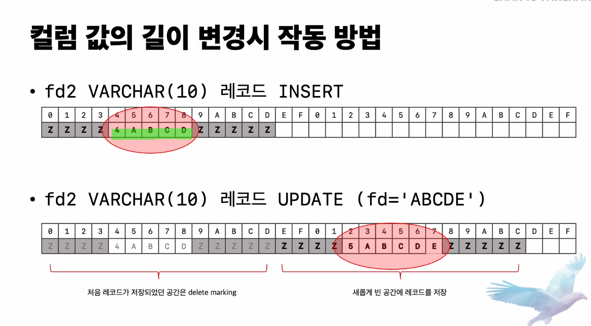

# CHAR, VARCHAR, TEXT

MySQL에서 CHAR, VARCHAR, TEXT는 모두 문자열을 저장하는 자료형이다. 이들을 어떨 때 사용해야하는 지를 간단하게 정리한다.

## CHAR VS VARCHAR

CHAR, VARCHAR는 문자열을 저장하는 자료형으로, 문자열을 저장하고 최대 문자 길이는 가변이기에 명시하여 지정한다는 특징이 있다.

CHAR는 값의 실제 크기와 관계 없이 고정된 공간을 할당하지만, VARCHAR는 크기에 맞는 공간을 할당한다는 차이점이 존재한다. 또한 VARCHAR는 저장된 문자열의 길이를 저장하는 데 문자열의 크기에 따라서 1Byte나 2Byte를 추가로 사용해야한다.

하지만 CHAR도 UTF-8과 같은 가변 길이 문자셋일 경우는 CHAR도 값의 길이를 관리한다.

공통점

- 문자열을 저장한다.
- 최대 문자 길이가 가변이다.

차이점

- CHAR는 값의 실제 크기와 무관하게 고정된 공간을 할당하지만 VARCHAR는 크기에 맞는 공간을 할당함.

- VARCHAR는 지정된 문자열의 길이를 지정하기에 1 ~ 2 Byte를 더 사용한다.

 

흔히들 고정된 길이의 값은 CHAR를 그렇지 않으면 VARCHAR를 사용한다고 이해하고 있지만 실제로는 큰 차이가 없다고 한다. 예를 들어 주문등록번호를 CHAR(13)이나 VARCHAR(13)으로 지정해도 길이를 저장하는 1 Byte 밖에 차이가 안 나기에 서비스에 영향을 거의 주지 않는다.

하지만 값을 수정하는 데에 있어서 차이를 보인다.

VARCHAR 같은 경우는 길이가 10이더라도, 실제 데이터의 사이즈에 맞게 공간을 할당하기에 더 많은 사이즈의 값으로 데이터를 수정하게 된다면 새로운 빈 공간에 레코드를 저장하고 구 데이터는 delete marking 처리를 하기에 비효율적이라 볼 수 있다.

하지만 CHAR는 실제 할당되는 사이즈와 무관하게 공간을 차지하기에 그 자리에 바로 데이터를 덮어씌우게 된다.

따라서 CHAR와 VARCHAR를 비교할 때는 가변 길이가 좁고 자주 변경되면 CHAR를 사용하는 것이 더 좋으며, 특히 INDEX 컬럼이면 CHAR가 더 좋다고 한다.

 

### VARCHAR VS TEXT

VARCHAR와 TEXT는 모두 문자열을 저장하는 타입이며 최대 65535Byte까지 저장이 가능하다는 특징이 있다. 하지만 VARCHAR는 지정된 글자 수만큼만 데이터가 저장 가능하지만 TEXT는 그렇지 않다는 특징이 있다.

먼저 VARCHAR를 자세히 보자.VARCHAR는 지정된 수만큼의 데이터를 저장 가능하지만 버퍼 공간을 미리 만들고 재활용할 수 있다. 즉 메모리 공간을 재 사용할 수 있다는 거다. 따라서 칼럼 사용이 빈번하게 발생하고 데이터베이스의 메모리 용량이 충분하다면 VARCHAR를 사용하는 것이 좋다.

하지만 VARCHAR(5000)과 같이 긴 컬럼을 자주 추가하는 경우에는 Row 사이즈 제한에 도달될 수 있기에 TEXT와 병행하는 것이 좋다.

TEXT는 글자수를 지정하진 않지만 TEXT 타입의 컬럼을 INDEX로 생성할 경우 prefix를 반드시 지정해야하고 default 값 지정에 있어서 표현식만 가능하다는 특징이 있다. 또한 TEXT는 메모리 공간을 재사용할 수 없기에 필요할 때 마다 할당하고 해제한다.

저장되는 값의 사이즈가 크면 Off-Page 형태로 데이터가 저장될 수 있는 데 이는 실제 데이터의 포인터 값을 디비에 저장하여 참조하여 가져오는 것을 의미한다. 하지만 Off-page 포함 여부에 따라서 쿼리 처리 성능이 매우 달라지기에 유의해야한다.

정리를 하자면 상대적으로 지정되는 사이즈가 작고 컬럼 사용이 빈번하며 데이터베이스의 메모리가 충분하면 VARCHAR를 사용하고 지정되는 사이즈가 크고 컬럼 사용이 적고 이미 문자열 컬럼들이 많이 사용하고 있으면 TEXT를 사용하자.
